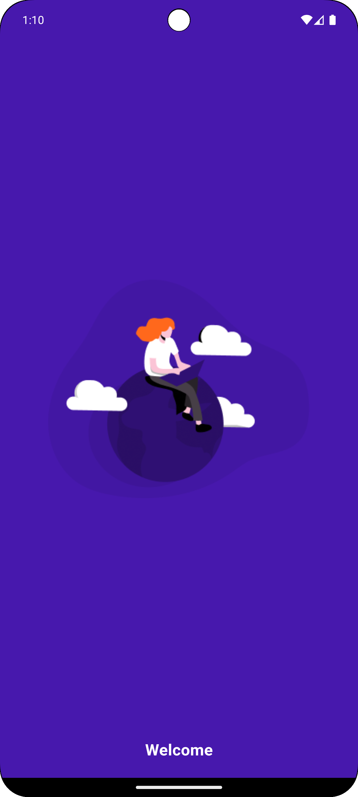
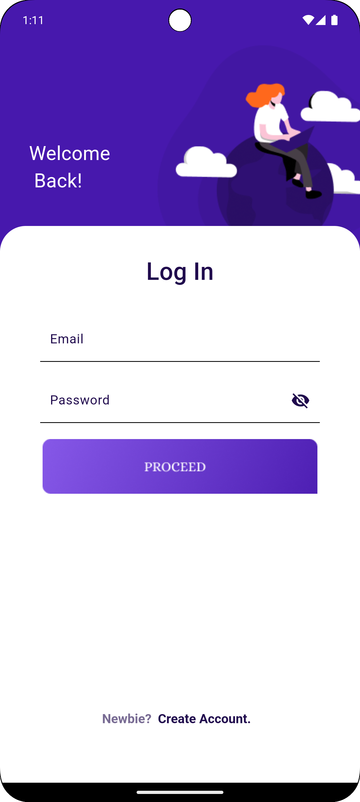
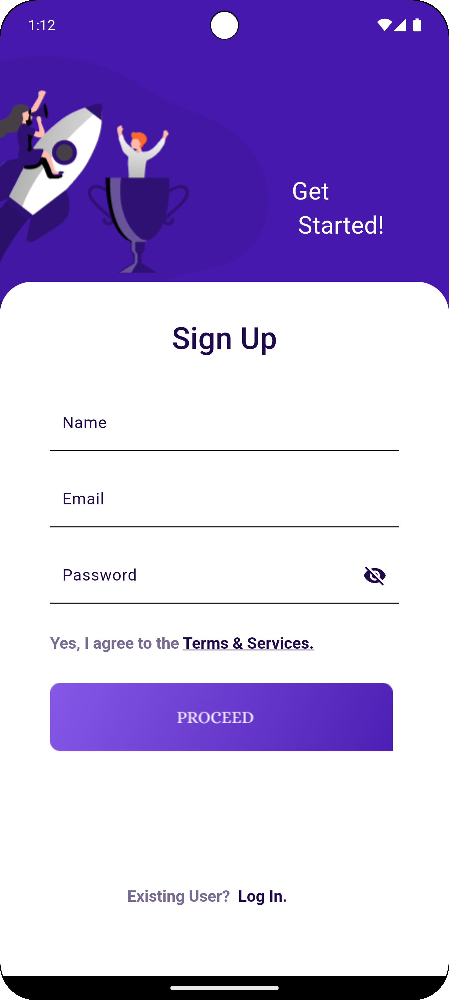
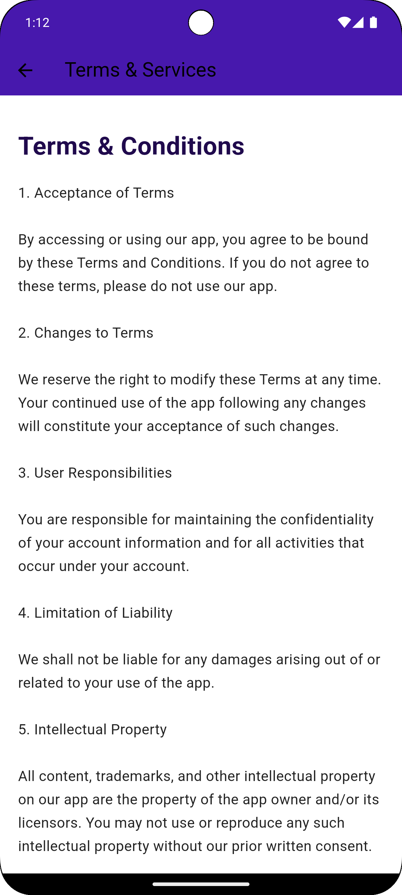
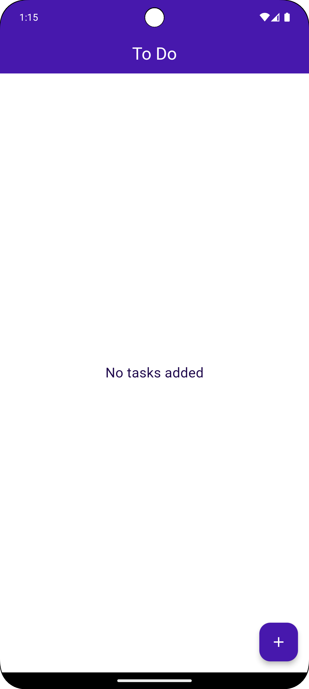
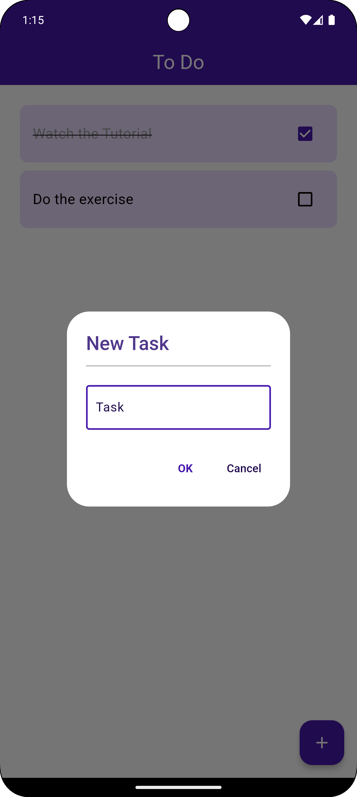
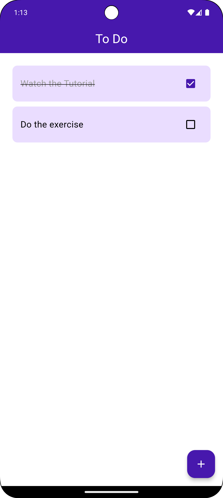
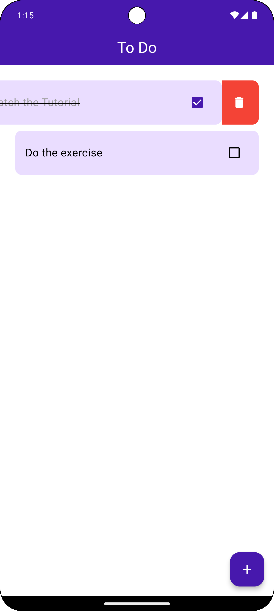

# Flutter To-Do App

This project is a sleek to-do application built using Flutter. It features a user-friendly task management interface, splash screen, login and signup pages, and a Terms & Services section, offering a complete to-do list experience.

## Features

- **Splash Screen**: A welcome screen with a logo and smooth transition to the login page.
- **Login and Signup**: Form-based user authentication with custom validation.
- **Task Management**: Create, view, and delete tasks from your to-do list.
- **Terms & Services**: Displays app terms and conditions.
- **Custom Theming**: Supports light themes with custom styling for various components.
- **Image Assets**: Utilizes custom images for buttons and other visual elements.

## Getting Started

### Prerequisites

- [Flutter](https://flutter.dev/docs/get-started/install) should be installed on your machine.
- An IDE such as [VS Code](https://code.visualstudio.com/) or [Android Studio](https://developer.android.com/studio).

### Installation

1. Clone the repository:
   ```bash
   git clone https://github.com/your-username/flutter-todo-app.git
   ```
2. Navigate to the project directory:
   ```bash
   cd flutter-todo-app
   ```
3. Get the dependencies:
   ```bash
   flutter pub get
   ```

### Running the App

1. Connect your device or start an emulator.
2. Run the app:
   ```bash
   flutter run
   ```

## Screenshots











## Customization

- **Themes**: Customize the light and dark themes in `theme.dart`.
- **Task List**: Modify how tasks are handled in `home_page.dart`.
- **Authentication**: Adjust the login and signup behavior in `login_page.dart` and `signup_page.dart`.
- **Terms & Services**: Update terms content in `terms_page.dart`.

## Folder Structure

```
├── assets                 # All app assets such as images
│   ├── btn                # Button images
│   └── project_photos     # Project screenshots and photos
├── lib                    # Main application code
│   ├── screens            # UI screens (Login, Signup, Splash, Terms, Home, etc.)
│   ├── theme.dart         # App-wide theme settings
│   ├── main.dart          # Main entry point of the app
└── pubspec.yaml           # Dependency file
```

## Contact

For any questions or suggestions, feel free to reach out to `ranaesmailhelal@gmail.com`.
```


